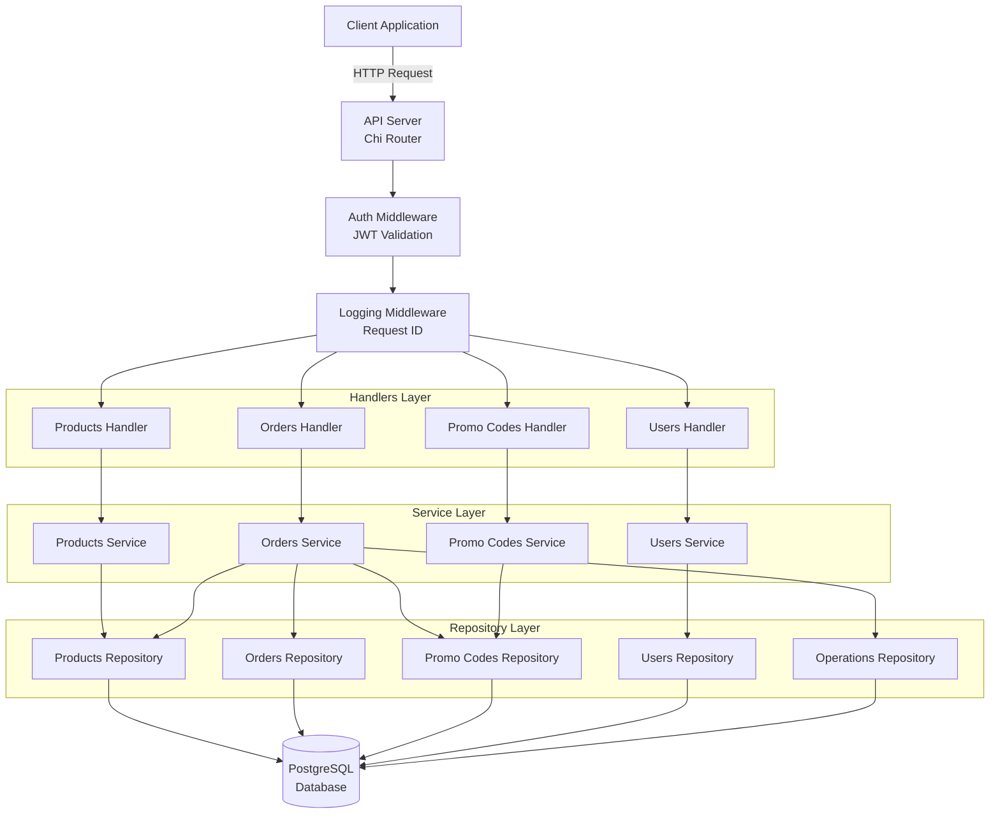
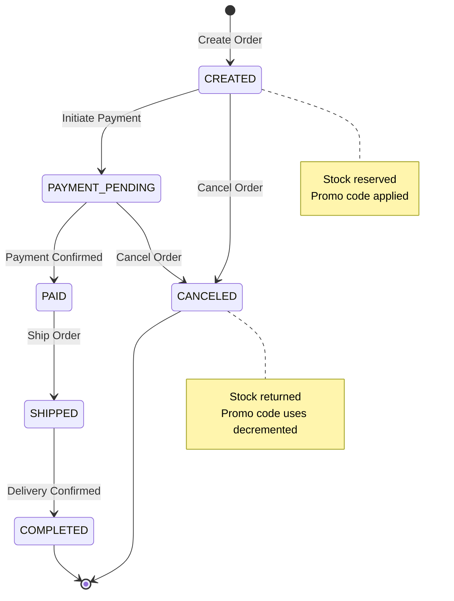

# Marketplace Backend Service

RESTful API backend for a marketplace platform with product management, order processing, promo codes, and JWT authentication.

## Features

- **Product Management**: CRUD operations with soft delete, pagination, and filtering
- **Order Management**: Create orders with stock validation, promo code support, and state machine
- **Promo Codes**: Percentage and fixed amount discounts with validation
- **Authentication**: JWT-based auth with access and refresh tokens
- **Role-Based Access Control**: USER, SELLER, and ADMIN roles
- **Automatic Migrations**: Database schema managed by golang-migrate
- **JSON Logging**: Structured logging with request ID tracking

## Architecture



## Database Schema

```mermaid
erDiagram
    users ||--o{ orders : "creates"
    users ||--o{ products : "sells"
    users ||--o{ user_operations : "performs"
    
    products ||--o{ order_items : "in"
    orders ||--|{ order_items : "contains"
    orders }o--o| promo_codes : "applies"
    
    users {
        uuid id PK
        varchar_255 email UK
        varchar_255 password_hash
        user_role role
        timestamp created_at
        timestamp updated_at
    }
    
    products {
        uuid id PK
        varchar_255 name
        varchar_4000 description
        decimal_12_2 price
        integer stock
        varchar_100 category
        product_status status
        uuid seller_id FK "nullable"
        timestamp created_at
        timestamp updated_at
    }
    
    orders {
        uuid id PK
        uuid user_id FK
        order_status status
        uuid promo_code_id FK "nullable"
        decimal_12_2 total_amount
        decimal_12_2 discount_amount
        timestamp created_at
        timestamp updated_at
    }
    
    order_items {
        uuid id PK
        uuid order_id FK
        uuid product_id FK
        integer quantity
        decimal_12_2 price_at_order
    }
    
    promo_codes {
        uuid id PK
        varchar_20 code UK
        discount_type discount_type
        decimal_12_2 discount_value
        decimal_12_2 min_order_amount
        integer max_uses
        integer current_uses
        timestamp valid_from
        timestamp valid_until
        boolean active
    }
    
    user_operations {
        uuid id PK
        uuid user_id FK
        operation_type operation_type
        timestamp created_at
    }
```



## Order State Machine



## Quick Start

### Prerequisites

- Docker and Docker Compose (or Podman)
- Go 1.25+ (for local development)

### Run with Docker Compose

```bash
# Start all services
docker-compose up -d

# Check logs
docker-compose logs -f marketplace-api

# Stop services
docker-compose down
```

The API will be available at `http://localhost:8080`

### Sample Requests

**Register a user:**
```bash
curl -X POST http://localhost:8080/auth/register \
  -H "Content-Type: application/json" \
  -d '{"email":"user@example.com","password":"password123","role":"USER"}'
```

**Login:**
```bash
curl -X POST http://localhost:8080/auth/login \
  -H "Content-Type: application/json" \
  -d '{"email":"user@example.com","password":"password123"}'
```

**List products:**
```bash
curl http://localhost:8080/products
```

**Create order (requires auth token):**
```bash
curl -X POST http://localhost:8080/orders \
  -H "Authorization: Bearer YOUR_ACCESS_TOKEN" \
  -H "Content-Type: application/json" \
  -d '{"items":[{"product_id":"PRODUCT_UUID","quantity":2}],"promo_code":"SAVE20"}'
```

## Database Migrations

Migrations run **automatically** when the application starts using **golang-migrate** (Go equivalent of Flyway/Liquibase).

### Migration Files

Located in `migrations/` directory:
- `000001_init_schema.up.sql` / `000001_init_schema.down.sql` - Initial schema
- `000002_seed_data.up.sql` / `000002_seed_data.down.sql` - Sample data

### How It Works

1. Application connects to PostgreSQL
2. golang-migrate checks for pending migrations
3. All pending migrations are applied in order
4. Application continues startup

The `schema_migrations` table tracks which migrations have been applied.

## Development

### Generate OpenAPI Code

```bash
make generate
```

### Build

```bash
make build
```

### Run Tests

```bash
make test
```

### Run Integration Tests

```bash
make integration-test
```

## Tech Stack

- **Language**: Go 1.25+
- **Database**: PostgreSQL 15
- **Router**: Chi v5
- **ORM**: sqlx
- **Authentication**: JWT (golang-jwt/jwt)
- **Logging**: zerolog
- **API Spec**: OpenAPI 3.0
- **Code Generation**: oapi-codegen v2
- **Migrations**: golang-migrate

## API Documentation

Full OpenAPI specification: [`api/openapi/marketplace.yaml`](api/openapi/marketplace.yaml)

### Key Endpoints

- `POST /auth/register` - Register new user
- `POST /auth/login` - Login and get tokens
- `POST /auth/refresh` - Refresh access token
- `GET /products` - List products (with pagination/filtering)
- `POST /products` - Create product (SELLER/ADMIN only)
- `POST /orders` - Create order (USER/ADMIN only)
- `POST /orders/{id}/cancel` - Cancel order
- `POST /promo-codes` - Create promo code (SELLER/ADMIN only)

## Error Codes

| Code | Description |
|------|-------------|
| `PRODUCT_NOT_FOUND` | Product does not exist |
| `PRODUCT_INACTIVE` | Cannot order inactive product |
| `ORDER_NOT_FOUND` | Order does not exist |
| `ORDER_LIMIT_EXCEEDED` | Rate limit exceeded |
| `ORDER_HAS_ACTIVE` | User has active order |
| `INVALID_STATE_TRANSITION` | Invalid order status change |
| `INSUFFICIENT_STOCK` | Not enough product stock |
| `PROMO_CODE_INVALID` | Promo code invalid/expired |
| `PROMO_CODE_MIN_AMOUNT` | Order below minimum |
| `ORDER_OWNERSHIP_VIOLATION` | Not order owner |
| `VALIDATION_ERROR` | Request validation failed |
| `TOKEN_EXPIRED` | Access token expired |
| `TOKEN_INVALID` | Invalid access token |
| `REFRESH_TOKEN_INVALID` | Invalid refresh token |
| `ACCESS_DENIED` | Insufficient permissions |

## License

MIT
