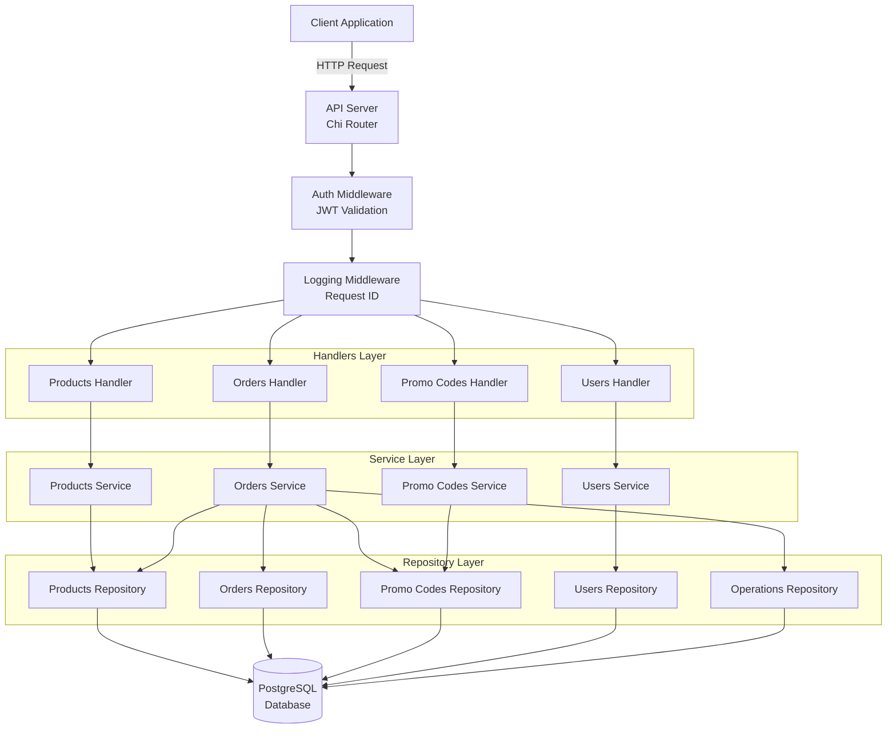
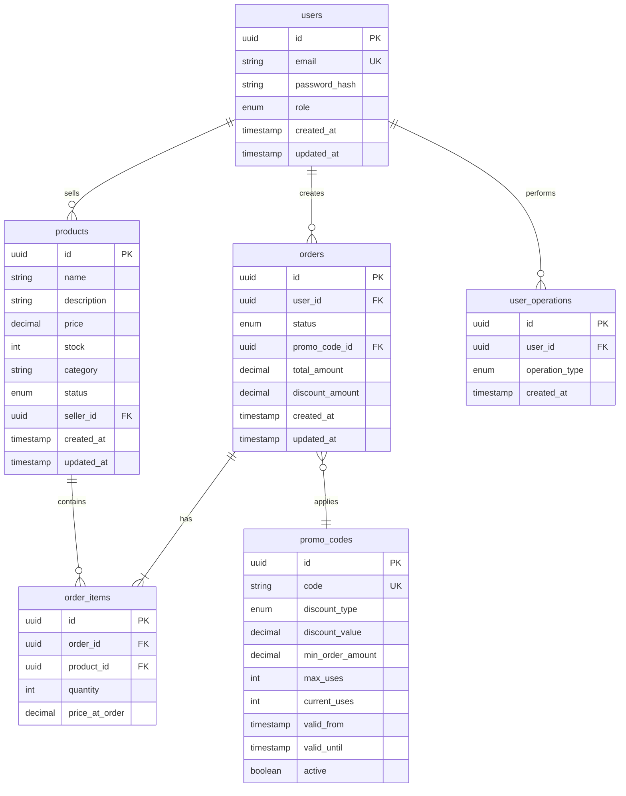
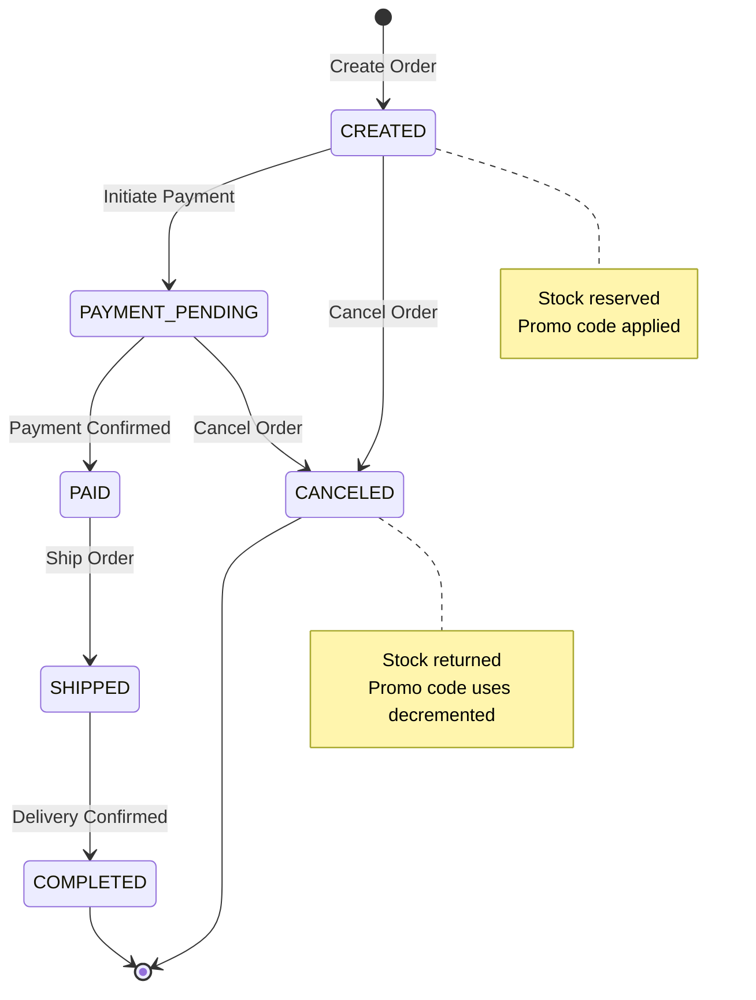
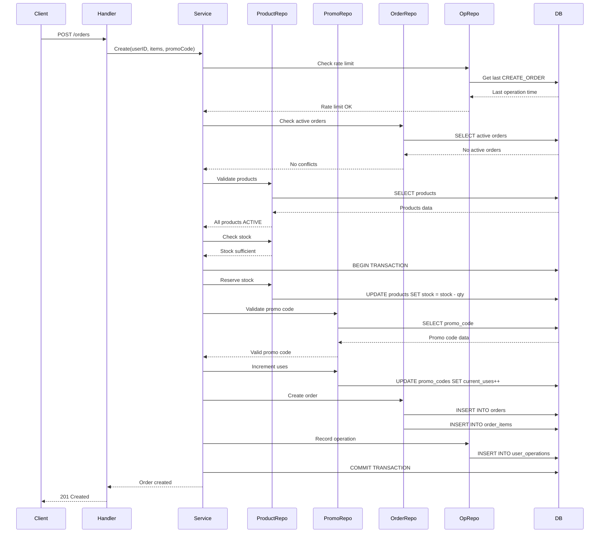

# Marketplace Backend Service

A complete RESTful API backend for a marketplace platform with product management, order processing, promo codes, and JWT authentication.

## Features

- **Product Management**: CRUD operations with soft delete, pagination, and filtering
- **Order Management**: Create orders with stock validation, promo code support, and state machine for order status
- **Promo Codes**: Percentage and fixed amount discounts with validation
- **Authentication**: JWT-based auth with access and refresh tokens
- **Role-Based Access Control**: USER, SELLER, and ADMIN roles
- **Rate Limiting**: Prevents order operation abuse
- **JSON Logging**: Structured logging with request ID tracking
- **Database Migrations**: Automated schema setup
- **Docker Support**: Complete containerization with Docker Compose

## Architecture Overview



## Database Schema



## Order State Machine



## Order Creation Flow



## Tech Stack

- **Language**: Go 1.25+
- **Database**: PostgreSQL 15
- **Router**: Chi v5
- **ORM**: sqlx
- **Authentication**: JWT (golang-jwt/jwt)
- **Logging**: zerolog
- **API Spec**: OpenAPI 3.0
- **Code Generation**: oapi-codegen v2

## Project Structure

```
.
├── api/
│   └── openapi/
│       └── marketplace.yaml          # OpenAPI specification
├── cmd/
│   └── server/
│       └── main.go                   # Application entry point
├── internal/
│   ├── domain/
│   │   └── models.go                 # Domain models
│   ├── errors/
│   │   └── errors.go                 # Error handling
│   ├── middleware/
│   │   ├── auth.go                   # JWT authentication
│   │   ├── logging.go                # Request logging
│   │   └── requestid.go              # Request ID tracking
│   ├── users/
│   │   ├── handler.go                # HTTP handlers
│   │   ├── repository.go             # Data access interface
│   │   ├── repository_impl.go        # PostgreSQL implementation
│   │   ├── service.go                # Business logic interface
│   │   └── service_impl.go           # Business logic implementation
│   ├── products/                     # Product module (same structure)
│   ├── orders/                       # Order module (same structure)
│   ├── promos/                       # Promo code module (same structure)
│   └── operations/                   # Rate limiting module
├── migrations/
│   └── init.sql                      # Database schema
├── docker-compose.yml                # Docker services configuration
├── Dockerfile                        # Application container
├── Makefile                          # Build automation
└── go.mod                            # Go dependencies

```

## Quick Start

### Prerequisites

- Docker and Docker Compose
- Go 1.25+ (for local development)
- Make (optional, for convenience)

### Running with Docker Compose

1. Clone the repository:
```bash
git clone <repository-url>
cd marketplace-backend
```

2. Start all services:
```bash
docker-compose up -d
```

This will start:
- PostgreSQL database on port 5432
- API server on port 8080

3. Check logs:
```bash
docker-compose logs -f api
```

4. Stop services:
```bash
docker-compose down
```

### Running Locally

1. Start PostgreSQL:
```bash
docker-compose up -d postgres
```

2. Set environment variables:
```bash
export DB_HOST=localhost
export DB_PORT=5432
export DB_USER=marketplace
export DB_PASSWORD=marketplace
export DB_NAME=marketplace
export JWT_SECRET=your-secret-key
export PORT=8080
```

3. Run migrations:
```bash
psql -h localhost -U marketplace -d marketplace -f migrations/init.sql
```

4. Build and run:
```bash
make build
./bin/server
```

Or directly:
```bash
go run cmd/server/main.go
```

## API Documentation

### Authentication Endpoints

#### Register
```http
POST /auth/register
Content-Type: application/json

{
  "email": "user@example.com",
  "password": "password123",
  "role": "USER"
}
```

Response:
```json
{
  "access_token": "eyJ...",
  "refresh_token": "eyJ...",
  "token_type": "Bearer",
  "expires_in": 1800
}
```

#### Login
```http
POST /auth/login
Content-Type: application/json

{
  "email": "user@example.com",
  "password": "password123"
}
```

#### Refresh Token
```http
POST /auth/refresh
Content-Type: application/json

{
  "refresh_token": "eyJ..."
}
```

### Product Endpoints

#### List Products
```http
GET /products?page=1&size=20&category=electronics&status=ACTIVE
```

#### Get Product
```http
GET /products/{id}
```

#### Create Product (Requires SELLER or ADMIN role)
```http
POST /products
Authorization: Bearer {access_token}
Content-Type: application/json

{
  "name": "Product Name",
  "description": "Product description",
  "price": 99.99,
  "stock": 100,
  "category": "electronics"
}
```

#### Update Product (Requires ownership or ADMIN role)
```http
PUT /products/{id}
Authorization: Bearer {access_token}
Content-Type: application/json

{
  "name": "Updated Name",
  "price": 89.99,
  "stock": 150
}
```

#### Delete Product (Soft delete)
```http
DELETE /products/{id}
Authorization: Bearer {access_token}
```

### Order Endpoints

#### Create Order
```http
POST /orders
Authorization: Bearer {access_token}
Content-Type: application/json

{
  "items": [
    {
      "product_id": "uuid",
      "quantity": 2
    }
  ],
  "promo_code": "SAVE10"
}
```

#### Get Order
```http
GET /orders/{id}
Authorization: Bearer {access_token}
```

#### Update Order Status
```http
PUT /orders/{id}
Authorization: Bearer {access_token}
Content-Type: application/json

{
  "status": "PAID"
}
```

#### Cancel Order
```http
POST /orders/{id}/cancel
Authorization: Bearer {access_token}
```

### Promo Code Endpoints (ADMIN only)

#### Create Promo Code
```http
POST /promo-codes
Authorization: Bearer {access_token}
Content-Type: application/json

{
  "code": "SAVE10",
  "discount_type": "PERCENTAGE",
  "discount_value": 10,
  "min_order_amount": 50,
  "max_uses": 100,
  "valid_from": "2024-01-01T00:00:00Z",
  "valid_until": "2024-12-31T23:59:59Z"
}
```

## Environment Variables

| Variable | Description | Default |
|----------|-------------|---------|
| `DB_HOST` | PostgreSQL host | localhost |
| `DB_PORT` | PostgreSQL port | 5432 |
| `DB_USER` | Database user | marketplace |
| `DB_PASSWORD` | Database password | marketplace |
| `DB_NAME` | Database name | marketplace |
| `JWT_SECRET` | JWT signing secret | your-secret-key-change-in-production |
| `PORT` | API server port | 8080 |

## Business Logic

### Order State Machine

Valid order status transitions:
- `CREATED` → `PAYMENT_PENDING` or `CANCELED`
- `PAYMENT_PENDING` → `PAID` or `CANCELED`
- `PAID` → `SHIPPED`
- `SHIPPED` → `COMPLETED`
- `COMPLETED` → (final state)
- `CANCELED` → (final state)

### Rate Limiting

- Order creation: Maximum 1 operation per 5 minutes per user
- Order updates: Maximum 1 operation per 5 minutes per user

### Promo Codes

- **Percentage discount**: Up to 70% of order total
- **Fixed amount**: Cannot exceed order total
- Validates: active status, usage limits, date range, minimum order amount

### Stock Management

- Stock is reserved when order is created
- Stock is returned when order is canceled
- Prevents overselling with transaction-level locking

## Development

### Build

```bash
make build
```

### Run Unit Tests

```bash
make test
```

### Run Integration Tests

The integration tests will automatically start Docker Compose, run all tests, and clean up:

```bash
make integration-test
```

The integration tests cover:
- User registration and authentication (USER, SELLER, ADMIN roles)
- JWT token generation and refresh
- Product CRUD operations with role-based access control
- Promo code management (ADMIN only)
- Order creation with promo code application
- Order status transitions and state machine validation
- Rate limiting for order operations
- Stock management and reservation
- Access control (users can only access their own orders, admins can access all)

### Generate OpenAPI Code

```bash
make generate
```

### Clean Build Artifacts

```bash
make clean
```

### Docker Commands

```bash
# Start services
make docker-up

# Stop services
make docker-down

# View logs
make docker-logs

# Build Docker image
make docker-build
```

## Error Codes

| Code | Description |
|------|-------------|
| `PRODUCT_NOT_FOUND` | Product does not exist |
| `PRODUCT_INACTIVE` | Cannot order inactive product |
| `ORDER_NOT_FOUND` | Order does not exist |
| `ORDER_LIMIT_EXCEEDED` | Rate limit exceeded |
| `ORDER_HAS_ACTIVE` | User has active order |
| `INVALID_STATE_TRANSITION` | Invalid order status change |
| `INSUFFICIENT_STOCK` | Not enough product stock |
| `PROMO_CODE_INVALID` | Promo code invalid/expired |
| `PROMO_CODE_MIN_AMOUNT` | Order below minimum |
| `ORDER_OWNERSHIP_VIOLATION` | Not order owner |
| `VALIDATION_ERROR` | Request validation failed |
| `TOKEN_EXPIRED` | Access token expired |
| `TOKEN_INVALID` | Invalid access token |
| `REFRESH_TOKEN_INVALID` | Invalid refresh token |
| `ACCESS_DENIED` | Insufficient permissions |

## License

MIT
